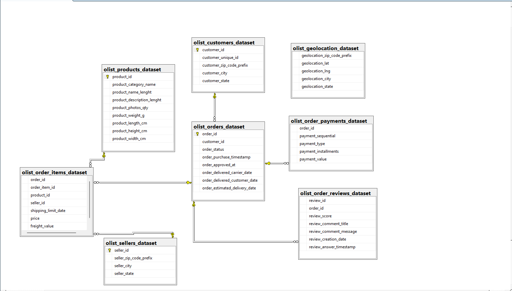
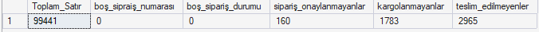
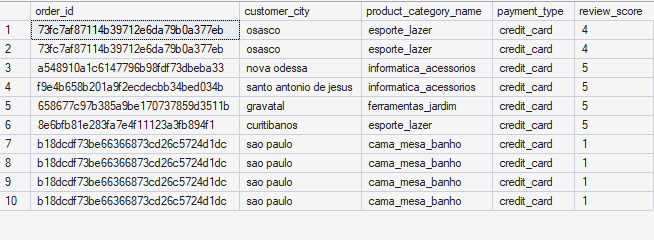
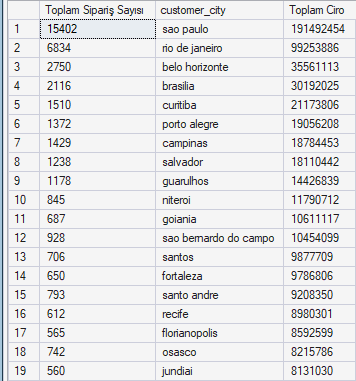
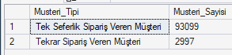
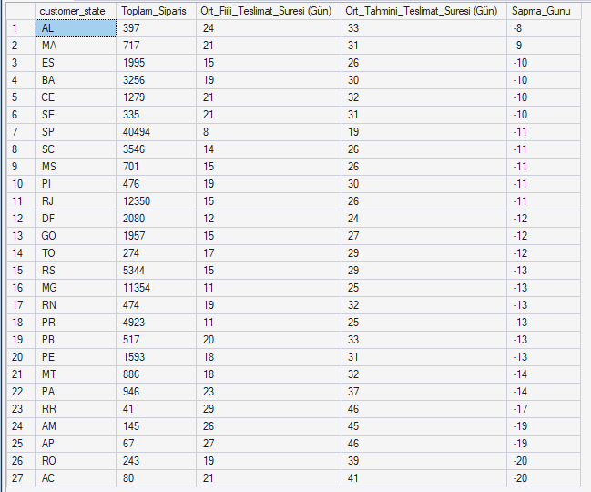
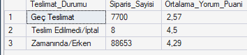
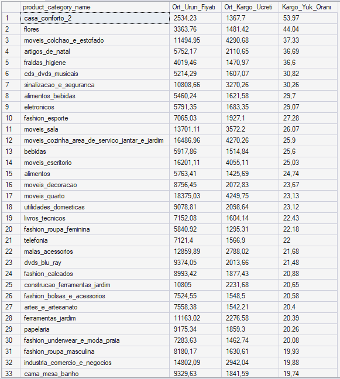
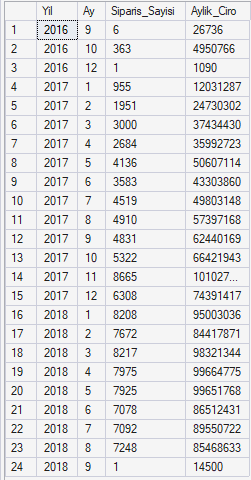

/*
Proje: Netflix Veri Seti Analizi
Yazar: Deniz BAL
Açıklama: Brazilian E-Commerce: Operasyonel Performans & Lojistik Analizi
Tarih: 2026-05-05
*/

## 📌 Proje Hakkında
Bu proje, Brezilya'nın en büyük pazar yeri olan Olist platformuna ait 2016-2018 yılları arasındaki gerçek verileri (100k sipariş) kapsamaktadır. Analizin temel amacı; 
ham veriyi işleyerek şirket büyümesi, lojistik darboğazlar ve müşteri memnuniyeti arasındaki bağları SQL kullanarak ortaya çıkarmaktır. 
Dokuz farklı tablonun birbiriyle ilişkilendirilmesini, karmaşık veri temizleme (data imputation) süreçlerini ve operasyonel verimlilik metriklerinin hesaplanmasını içerir.

## 🔍 Analiz Odak Noktaları
Data Cleaning: Eksik verilerin (NULL) iş mantığına göre doldurulması ve veri tutarlılığının sağlanması.
Business Growth: Yıllık ve aylık bazda ciro ve sipariş hacmi trendleri.
Logistics Performance: Tahmini vs. gerçekleşen teslimat sürelerinin eyalet bazlı karşılaştırılması.
Customer Satisfaction: Teslimat gecikmelerinin müşteri yorum puanlarına (Review Score) doğrudan etkisi.

## 📂 Veri Modeli (ER Diagram)
Analizde kullanılan tablolar arasındaki ilişkileri anlamak için aşağıdaki şema baz alınmıştır:

Veri temizleme (Data Cleaning)

## 📊 Öne Çıkan Bulgular
-Multi joın denemesi

-sao paulo ve rio de janeiro metropol şehirleri toplam cironun büyük kısmını oluşturuyor.

-Müşterilerin büyük çoğunluğu tek seferlik alışveriş yapmaktadır.

-Şirketin şipariş teslimatı 8-20 gün arasında geçikmeler oluyor. Bu şehirlerin lojistik partnerleri değiştirilmesi gerekmektedir.

-7700 Adet sipariş geç teslim edildi. Yorum puanı düşük 2.5 ortalama ile düşük kalmıştır. Siparişlerin ilgili olan lojistik partnerlerle sorunun giderilmesi gerekir.

-Kargo Ücreti analizi (Kargo yük oranına göre)

-Şirket Büyüme raporu

-- 2017 yılında 1 yıl içinde ciro 9 kat büyüme göstermiştir. Reklam ve pazarlama stratejisi kazançlı çıkmıştır. Şirket 'Black friday' etkisine önem verip, yatırım yapmıştır. 
-- 2018 yılında olis şirketi sipariş sayısını 7000-8000 arasında tutmuştur. Şirket büyümek yerine elde olan müşterilere yatırımda bulunmuş gibi görünüyor.
-- 2018 9. ayında veri toplama sona erdiği görülmüştür.

## 📬 İletişim
Bu proje ile ilgili sorularınız veya önerileriniz için benimle [LinkedIn profilim](https://www.linkedin.com/in/deniz-bal-64838b225) üzerinden iletişime geçebilirsiniz.

